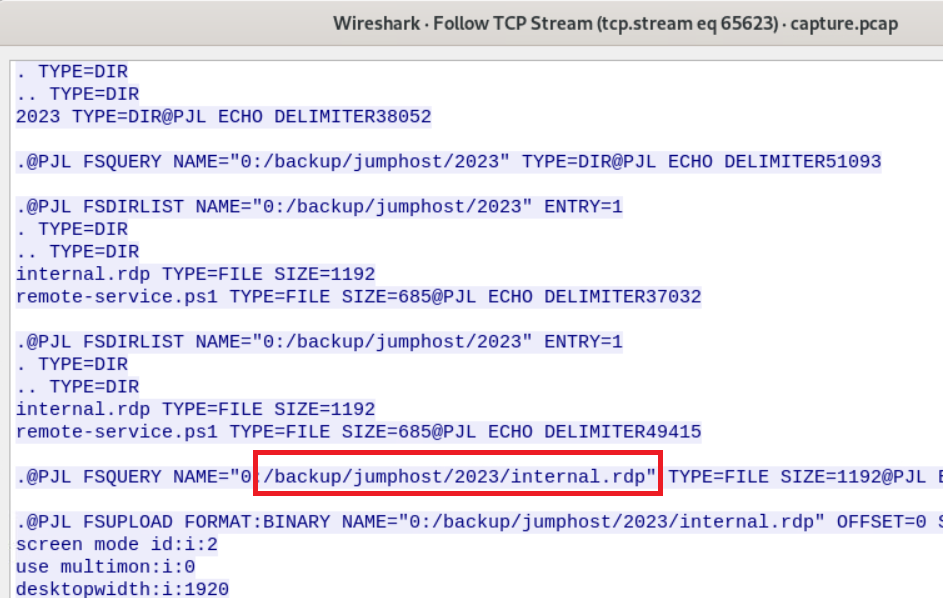
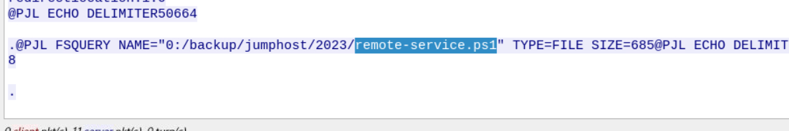

> # Compromised Network Printer

## Summary
- [Summary](#summary)
  - [Q1. Identify the port scan activity performed by the attacker on the network. What was the NAT IP Address(Internal IP Address) assigned to the machine being used by the attacker on the internal network?](#q1-identify-the-port-scan-activity-performed-by-the-attacker-on-the-network-what-was-the-nat-ip-addressinternal-ip-address-assigned-to-the-machine-being-used-by-the-attacker-on-the-internal-network)
  - [Q2. Which ports were open on the network printer? Identify the port used for printer exploitation.](#q2-which-ports-were-open-on-the-network-printer-identify-the-port-used-for-printer-exploitation)
  - [Q3. Based on the abused port number, which printer language/method was being abused by the attacker for unattended malicious activity on the network printer?](#q3-based-on-the-abused-port-number-which-printer-languagemethod-was-being-abused-by-the-attacker-for-unattended-malicious-activity-on-the-network-printer)
  - [Q4. Which Printer Name/Model was attacked?](#q4-which-printer-namemodel-was-attacked)
  - [Q5. The attacker has discovered a scheduled print job that is associated with an employee who is suspected of being an insider threat. What is the full path of the print job file?](#q5-the-attacker-has-discovered-a-scheduled-print-job-that-is-associated-with-an-employee-who-is-suspected-of-being-an-insider-threat-what-is-the-full-path-of-the-print-job-file)
  - [Q6. What is the name of the targeted organization?](#q6-what-is-the-name-of-the-targeted-organization)
  - [Q7. The attacker found information about RDP within the internal network. What is the directory path where this sensitive information was located?](#q7-the-attacker-found-information-about-rdp-within-the-internal-network-what-is-the-directory-path-where-this-sensitive-information-was-located)
  - [Q8. What is the IP address of the Jumphost?](#q8-what-is-the-ip-address-of-the-jumphost)
  - [Q9. What is the filename of the PowerShell script used by admins which was also found by the attacker?](#q9-what-is-the-filename-of-the-powershell-script-used-by-admins-which-was-also-found-by-the-attacker)

### Q1. Identify the port scan activity performed by the attacker on the network. What was the NAT IP Address(Internal IP Address) assigned to the machine being used by the attacker on the internal network?
Open the .pcap file, the IP `172.31.40.241` send multiple `RST` packet to IP `172.31.35.23` to notify that port is not open. 
 
**Answer:** 172.31.35.23

### Q2. Which ports were open on the network printer? Identify the port used for printer exploitation.
If the port was opened, it will response with the `SYN/ACK` packet, so we will filter this type of packet with `tcp.flags == 0x0012`. 
 
The port 9100 is open on the printer machine. 
**Answer:** 9100

### Q3. Based on the abused port number, which printer language/method was being abused by the attacker for unattended malicious activity on the network printer?
Follow TCP stream, you will the string `PJL` appear many times, search on the Internet it is `Printer Job Language`
 
 
**Answer:** PJL

### Q4. Which Printer Name/Model was attacked?
At stream 65563, we see the model of printer. 
 
**Answer:** HP LaserJet Pro 4001dn

### Q5. The attacker has discovered a scheduled print job that is associated with an employee who is suspected of being an insider threat. What is the full path of the print job file?
Also in this stream, search `job` string you will see the full path of the print job call to the powershell file. 
 
**Answer:** 0:/saveDevice/SavedJobs/InProgress/scheduled.ps

### Q6. What is the name of the targeted organization?
The content of the above powershell file contain the organization name. 
 
**Answer:** LetsDefend Corp Company

### Q7. The attacker found information about RDP within the internal network. What is the directory path where this sensitive information was located?
At stream 65623, you will see tha path of the `.rdp` file. 
 
**Answer:** /backup/jumphost/2023

### Q8. What is the IP address of the Jumphost?
The `internal.rdp` file has the IP of jump host. 
 
**Answer:** 172.31.23.97

### Q9. What is the filename of the PowerShell script used by admins which was also found by the attacker?
The attacker found the powershell also in the folder contains `.rdp` file. 
 
**Answer:** remote-service.ps1
