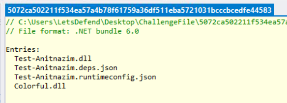
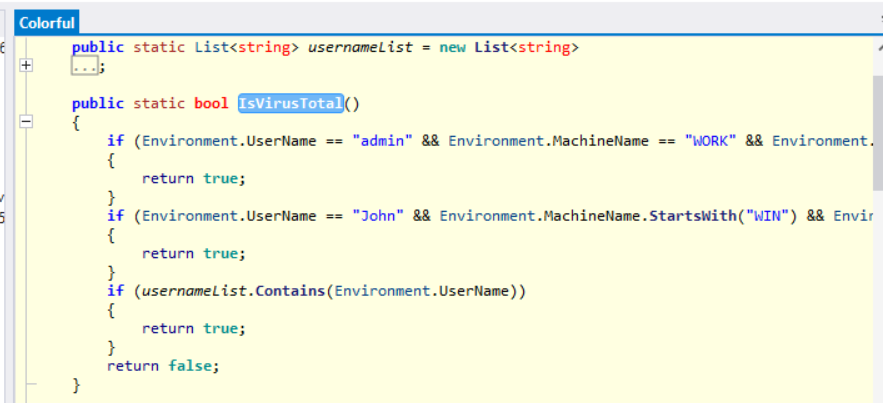
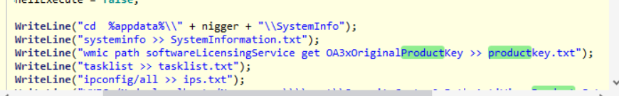

> # DLL Stealer

## Summary
- [Summary](#summary)
  - [Q1. What is the DLL that has the stealer code?](#q1-what-is-the-dll-that-has-the-stealer-code)
  - [Q2. What is the anti-analysis method used by the malware?](#q2-what-is-the-anti-analysis-method-used-by-the-malware)
  - [Q3. What is the full command used to gather information from the system into the “productkey.txt” file?](#q3-what-is-the-full-command-used-to-gather-information-from-the-system-into-the-productkeytxt-file)
  - [Q4. What is the full command used to gather information through the "ips.txt" file?](#q4-what-is-the-full-command-used-to-gather-information-through-the-ipstxt-file)
  - [Q5. What is the webhook used by the malware?](#q5-what-is-the-webhook-used-by-the-malware)

### Q1. What is the DLL that has the stealer code?
Open the sample file in ILSpy, you will see all DLL name embedded in the sample file. 
 
**Answer:** Colorful.dll

### Q2. What is the anti-analysis method used by the malware?
The `Colorfull.dll` has a method name `IsVirusTotal` that check the username and the hostname of the machine. 
 
**Answer:** IsVirusTotal

### Q3. What is the full command used to gather information from the system into the “productkey.txt” file?
Search the string `productkey.txt`. 
 
**Answer:** wmic path softwareLicensingService get OA3xOriginalProductKey >> productkey.txt

### Q4. What is the full command used to gather information through the "ips.txt" file?
From the above image, tha attacker save result of `ipconfig /all` to `ips.txt`. 
**Answer:** ipconfig/all >> ips.txt

### Q5. What is the webhook used by the malware?
Search string `webhook`, you will see the full URL. 
**Answer:** https://discord.com/api/webhooks/1165744386949271723/kFr6Cc0DSTK1jB8aV3820mBxji06gF2KorUuO2Rd2ckLkhUEHxdi6kv6UHwgJ_W82fgZ
