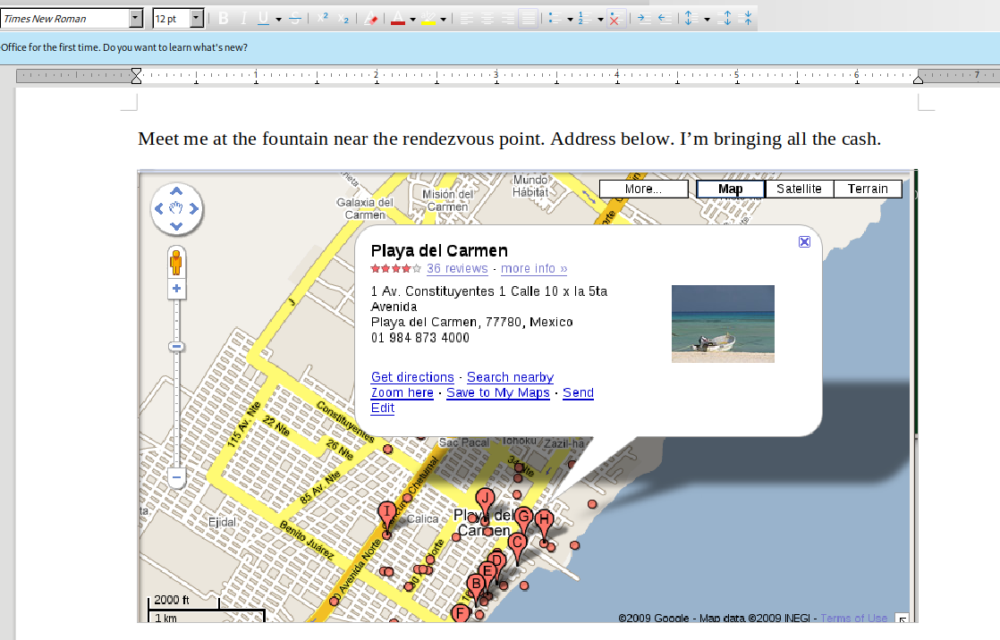

> # Disclose The Agent

# Summary
<!-- TOC -->

- [Summary](#summary)
    - [Q1. What is the email address of Ann's secret boyfriend?](#q1-what-is-the-email-address-of-anns-secret-boyfriend)
    - [Q2. What is Ann's email password?](#q2-what-is-anns-email-password)
    - [Q3. What is the name of the file that Ann sent to his secret lover?](#q3-what-is-the-name-of-the-file-that-ann-sent-to-his-secret-lover)
    - [Q4. In what country will Ann meet with her secret lover?](#q4-in-what-country-will-ann-meet-with-her-secret-lover)
    - [Q5. What is the MD5 value of the attachment Ann sent?](#q5-what-is-the-md5-value-of-the-attachment-ann-sent)

<!-- /TOC -->

## Q1. What is the email address of Ann's secret boyfriend?
Filter `smtp` protocol, then follow TCP stream. At stream 0, Ann rejected to lunch with `ec558@gmail.com`.<br>
<br>
At stream 1, Ann replie an email with subject `rendezvous` with his boyfriend.<br>
<br>
**Answer:** mistersecretx@aol.com

## Q2. What is Ann's email password?
Ann perform login action before sending email to his secret lover. The red area is password encoded with base64.<br>
```
$ echo "UGFzc3dvcmQ6" | base64 -d            
Password:

$ echo "NTU4cjAwbHo=" | base64 -d
558r00lz
```
**Answer:** 558r00lz

## Q3. What is the name of the file that Ann sent to his secret lover?
AL in stream 1, it contains filename of the attackment.<br>
<br>
**Answer:** secretrendezvous.docx

## Q4. In what country will Ann meet with her secret lover?
Copy all base64 content of the attachment to text file, then decode it and save to file.
```
$ head doc.txt                     
UEsDBBQABgAIAAAAIQDleUAGfwEAANcFAAATAAgCW0NvbnRlbnRfVHlwZXNdLnhtbCCiBAIooAAC
AAAAAAAAAAAAAAAAAAAAAAAAAAAAAAAAAAAAAAAAAAAAAAAAAAAAAAAAAAAAAAAAAAAAAAAAAAAA
AAAAAAAAAAAAAAAAAAAAAAAAAAAAAAAAAAAAAAAAAAAAAAAAAAAAAAAAAAAAAAAAAAAAAAAAAAAA
AAAAAAAAAAAAAAAAAAAAAAAAAAAAAAAAAAAAAAAAAAAAAAAAAAAAAAAAAAAAAAAAAAAAAAAAAAAA
AAAAAAAAAAAAAAAAAAAAAAAAAAAAAAAAAAAAAAAAAAAAAAAAAAAAAAAAAAAAAAAAAAAAAAAAAAAA
AAAAAAAAAAAAAAAAAAAAAAAAAAAAAAAAAAAAAAAAAAAAAAAAAAAAAAAAAAAAAAAAAAAAAAAAAAAA
AAAAAAAAAAAAAAAAAAAAAAAAAAAAAAAAAAAAAAAAAAAAAAAAAAAAAAAAAAAAAAAAAAAAAAAAAAAA
AAAAAAAAAAAAAAAAAAAAAAAAAAAAAAAAAAAAAAAAAAAAAAAAAAAAAAAAAAAAAAAAAAAAAAAAAAAA
AAAAAAAAAAAAAAAAAAAAAAAAAAAAAAAAAAAAAAAAAAAAAAAAAAAAAAAAAAAAAAAAAAAAAAAAAAAA
AAAAAAAAAAAAAAAAAAAAAAAAAAAAAAAAAAAAAAAAAAAAAAAAAAAAAAAAAAAAAAAAAAAAAAAAAAC0

$ cat doc.txt| base64 -d > ori.docx

$ file ori.docx                    
ori.docx: Microsoft Word 2007+
```
You will receive a the original docx file, open it to see which country Ann meet her secret lover.<br>
<br>
**Answer:** Mexico

## Q5. What is the MD5 value of the attachment Ann sent?
Use `md5sum` to calculate its md5 hash.<br>
```
$ md5sum ori.docx 
9e423e11db88f01bbff81172839e1923  ori.docx
```
**Answer:** 9e423e11db88f01bbff81172839e1923
