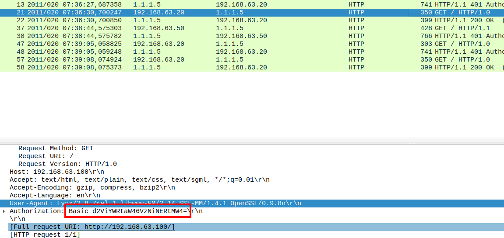

> Http Basic Auth - LetSDefend.io

## Summary
* [Q1. How many HTTP GET requests are in pcap?](#q1-how-many-http-get-requests-are-in-pcap)
* [Q2. What is the server operating system?](#q2-what-is-the-server-operating-system)
* [Q3. What is the name and version of the web server software?](#q3-what-is-the-name-and-version-of-the-web-server-software)
* [Q4. What is the version of OpenSSL running on the server?](#q4-what-is-the-version-of-openssl-running-on-the-server)
* [Q5. What is the client's user-agent information?](#q5-what-is-the-clients-user-agent-information)
* [Q6. What is the username used for Basic Authentication?](#q6-what-is-the-username-used-for-basic-authentication)
* [Q7. What is the user password used for Basic Authentication?](#q7-what-is-the-user-password-used-for-basic-authentication)

### Q1. How many HTTP GET requests are in pcap?
Open the material with Wireshark, filter with `http.request.medthode==GET`.<br>
<br>
**Answer:** {5}

### Q2. What is the server operating system?
Based on the respone packet of GET request, we will see the server's info.<br>
<br>
**Answer:** {FreeBSD}

### Q3. What is the name and version of the web server software?
From image of Q2, in the left of the OS info is the name and version of web server.<br>
**Answer:** {Apache/2.2.15}

### Q4. What is the version of OpenSSL running on the server?
Also from of Q2.<br>
**Answer:** {OpenSSL/0.9.8n}

### Q5. What is the client's user-agent information?
Filter as Q1, select packet has IP source is 192.168.63.20. In packet data panel, select HTTP and find Use-agent field.<br>
<br>
**Answer:** {Lynx/2.8.7rel.1 libwww-FM/2.14 SSL-MM/1.4.1 OpenSSL/0.9.8n}

### Q6. What is the username used for Basic Authentication?
At frame 21, in packet data panel, we see a field Authorization with a string decoded as base64.<br>
<br>
Decode this string to get the pplain text.<br>
```
$ echo -n "d2ViYWRtaW46VzNiNERtMW4=" | base64 -d
webadmin:W3b4Dm1n
```
**Answer:** {webadmin}

### Q7. What is the user password used for Basic Authentication?
From Q6, we already have the answer.<br>
**Answer:** {W3b4Dm1n}
