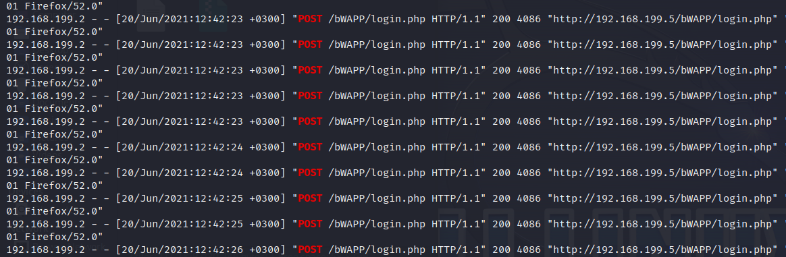
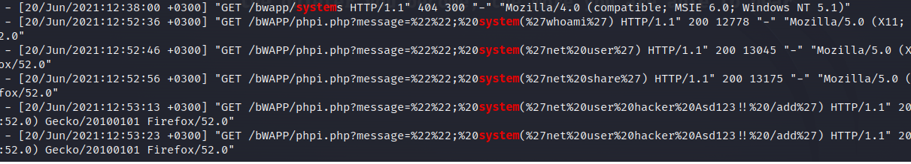

> # Investigate Web Attack

# Summary
<!-- TOC -->

- [Summary](#summary)
    - [Q1. Which automated scan tool did attacker use for web reconnansiance?](#q1-which-automated-scan-tool-did-attacker-use-for-web-reconnansiance)
    - [Q2. After web reconnansiance activity, which technique did attacker use for directory listing discovery?](#q2-after-web-reconnansiance-activity-which-technique-did-attacker-use-for-directory-listing-discovery)
    - [Q3. What is the third attack type after directory listing discovery?](#q3-what-is-the-third-attack-type-after-directory-listing-discovery)
    - [Q4. Is the third attack success?](#q4-is-the-third-attack-success)
    - [Q5. What is the name of fourth attack?](#q5-what-is-the-name-of-fourth-attack)
    - [Q6. What is the first payload for 4rd attack?](#q6-what-is-the-first-payload-for-4rd-attack)
    - [Q7. Is there any persistency clue for the victim machine in the log file ? If yes, what is the related payload?](#q7-is-there-any-persistency-clue-for-the-victim-machine-in-the-log-file--if-yes-what-is-the-related-payload)

<!-- /TOC -->

## Q1. Which automated scan tool did attacker use for web reconnansiance?
Extract user-agent value from the log file, you will see the name of tool used by attacker.<br>
```
$ cat access.log|cut -d " " -f 13|sort|uniq
_;
(compatible;
(Macintosh;
(Nikto/2.1.6)
(X11;
```
**Answer:** Nikto

## Q2. After web reconnansiance activity, which technique did attacker use for directory listing discovery?
This tool try GET multiple path on the server.<br>
**Answer:** directory brute force

## Q3. What is the third attack type after directory listing discovery?
The attacker send multiple POST login form to the server on `login.php` page.<br>
<br>
**Answer:** brute force

## Q4. Is the third attack success?
The attacker can run command on the server.<br>
<br>
**Answer:** yes

## Q5. What is the name of fourth attack?
**Answer:** code injection

## Q6. What is the first payload for 4rd attack?
From the above image, the attacker run `whoami` first.<br>
**Answer:** whoami

## Q7. Is there any persistency clue for the victim machine in the log file ? If yes, what is the related payload?
The attacker create a new user on the system for persistence.<br>
**Answer:** %27net%20user%20hacker%20Asd123!!%20/add%27

