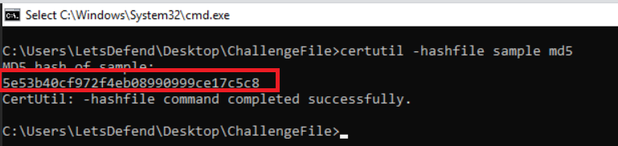
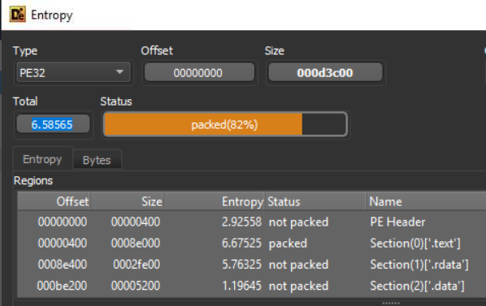
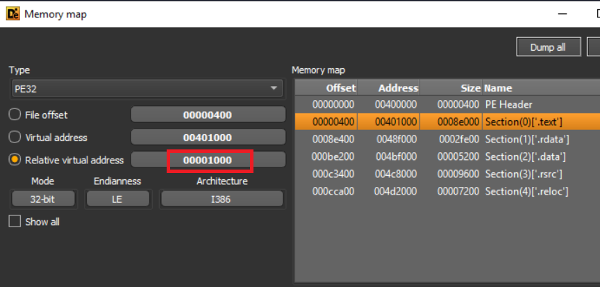
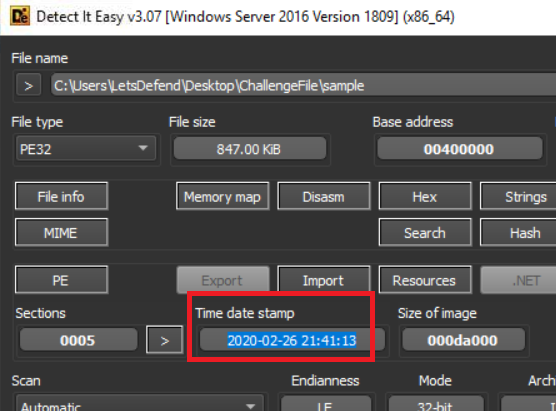
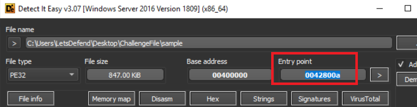
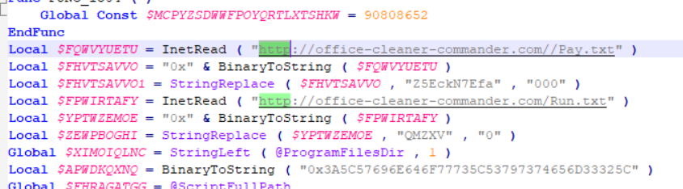
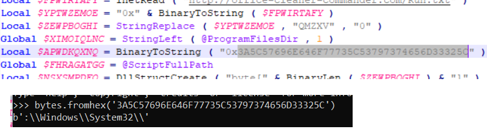
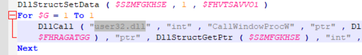

> # Malicious AutoIT

## Summary
- [Summary](#summary)
  - [Q1. What is the MD5 hash of the sample file?](#q1-what-is-the-md5-hash-of-the-sample-file)
  - [Q2. According to the Detect It Easy (DIE) tool, what is the entropy of the sample file?](#q2-according-to-the-detect-it-easy-die-tool-what-is-the-entropy-of-the-sample-file)
  - [Q3. According to the Detect It Easy(DIE) tool, what is the virtual address of the “.text” section?](#q3-according-to-the-detect-it-easydie-tool-what-is-the-virtual-address-of-the-text-section)
  - [Q4. According to the Detect Easy tool, what is the “time date stamp”?](#q4-according-to-the-detect-easy-tool-what-is-the-time-date-stamp)
  - [Q5. According to the Detect It Easy (DIE) tool, what is the entry point address of the executable?](#q5-according-to-the-detect-it-easy-die-tool-what-is-the-entry-point-address-of-the-executable)
  - [Q6. What is the domain used by the malicious embedded code?](#q6-what-is-the-domain-used-by-the-malicious-embedded-code)
  - [Q7. What is the file path encoded in hexadecimal in the malicious code?](#q7-what-is-the-file-path-encoded-in-hexadecimal-in-the-malicious-code)
  - [Q8. What is the name of the DLL called by the malicious code?](#q8-what-is-the-name-of-the-dll-called-by-the-malicious-code)

### Q1. What is the MD5 hash of the sample file?
Use `certutil -hashfile <path_to_file> md5` to calculate MD5 hash of the sample file. 
 
**Answer:** 5e53b40cf972f4eb08990999ce17c5c8

### Q2. According to the Detect It Easy (DIE) tool, what is the entropy of the sample file?
Open the sample file with the given tool, then select `Entrophy`. 
 
**Answer:** 6.58565

### Q3. According to the Detect It Easy(DIE) tool, what is the virtual address of the “.text” section?
Select `Memory` and `.text` section. 
 
**Answer:** 0x1000

### Q4. According to the Detect Easy tool, what is the “time date stamp”?
The anwser is on the dashboard when you open the sample file with the given tool. 
 
**Answer:** 2020-02-26 21:41:13

### Q5. According to the Detect It Easy (DIE) tool, what is the entry point address of the executable?
 
**Answer:** 0x42800a

### Q6. What is the domain used by the malicious embedded code?
Use built-in tool named `autoit-ripper` to extract autoit sample from the sample file. 
Then open the result file with `Notepad++` and search for the string `http`. 
 
**Answer:** office-cleaner-commander.com

### Q7. What is the file path encoded in hexadecimal in the malicious code?
In the result file, there is a hex string. I decode it with python to get the plaintext. 
 
**Answer:** :\Windows\System32\

### Q8. What is the name of the DLL called by the malicious code?
 
**Answer:** user32.dll
