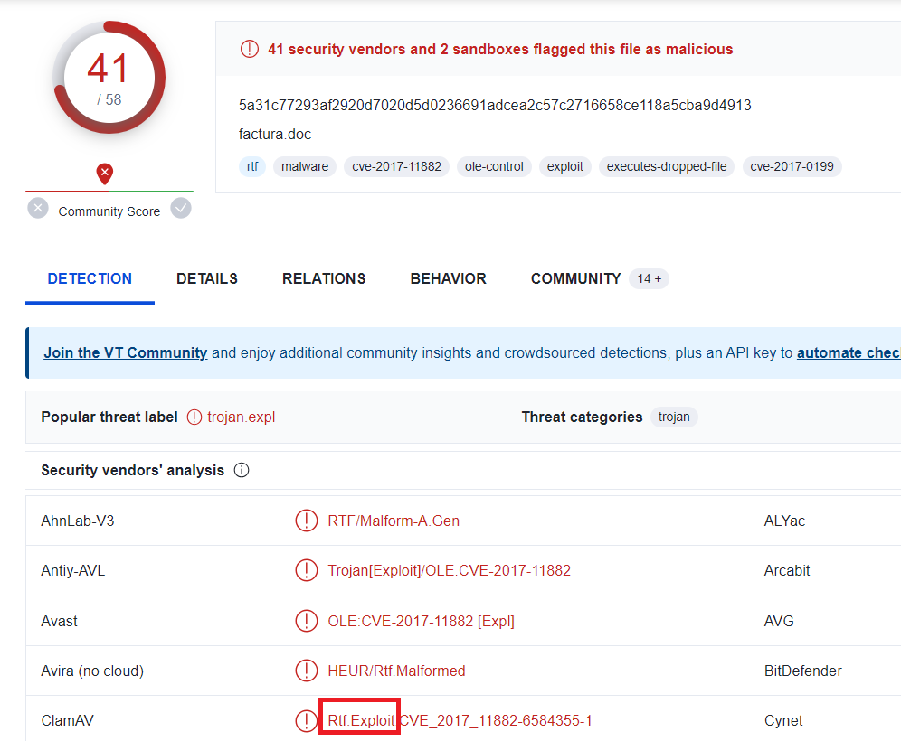
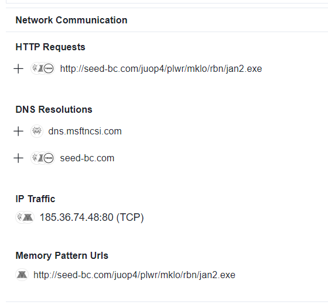
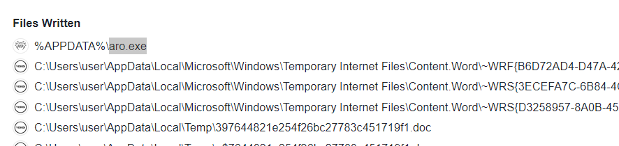

> # Malicious Doc

## Summary
<!-- TOC -->

- [Summary](#summary)
    - [Q1. What type of exploit is running as a result of the relevant file running on the victim machine?](#q1-what-type-of-exploit-is-running-as-a-result-of-the-relevant-file-running-on-the-victim-machine)
    - [Q2. What is the relevant Exploit CVE code obtained as a result of the analysis?](#q2-what-is-the-relevant-exploit-cve-code-obtained-as-a-result-of-the-analysis)
    - [Q3. What is the name of the malicious software downloaded from the internet as a result of the file running?](#q3-what-is-the-name-of-the-malicious-software-downloaded-from-the-internet-as-a-result-of-the-file-running)
    - [Q4. What is the ip address and port information it communicates with?](#q4-what-is-the-ip-address-and-port-information-it-communicates-with)
    - [Q5. What is the exe name it drops to disk after it runs?](#q5-what-is-the-exe-name-it-drops-to-disk-after-it-runs)

<!-- /TOC -->

### Q1. What type of exploit is running as a result of the relevant file running on the victim machine?
Calculate sha256 of this .doc file, then search the hash on [VirusTotal](https://www.virustotal.com/gui/file/5a31c77293af2920d7020d5d0236691adcea2c57c2716658ce118a5cba9d4913/detection), you will the type of exploit for this .doc file.<br>
```
$ sha256sum factura.doc 
5a31c77293af2920d7020d5d0236691adcea2c57c2716658ce118a5cba9d4913  factura.doc
```
<br>
**Answer:** Rtf.Exploit

### Q2. What is the relevant Exploit CVE code obtained as a result of the analysis?
From the above image, the malware family also contains the relevant CVE.<br>
**Answer:** CVE-2017-11882

### Q3. What is the name of the malicious software downloaded from the internet as a result of the file running?
View in Behavior tab, you will see the given file make a HTTP request to download a file from a domain.<br>
<br>
**Answer:** jan2.exe

### Q4. What is the ip address and port information it communicates with?
From the above image, there is also contains the IP and port which the .doc file communicates with.<br>
**Answer:** 185.36.74.48:80

### Q5. What is the exe name it drops to disk after it runs?
In `File Written`, the doc write a file in %APPDATA$ folder.<br>
<br>
**Answer:** aro.exe
