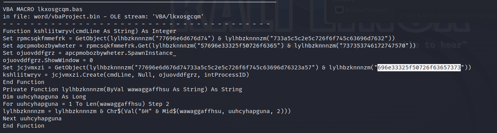
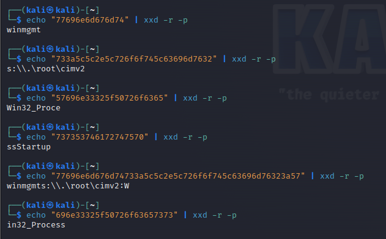

> # Malicious VBA

# Summary
<!-- TOC -->

- [Summary](#summary)
    - [Q1. The document initiates the download of a payload after the execution, can you tell what website is hosting it?](#q1-the-document-initiates-the-download-of-a-payload-after-the-execution-can-you-tell-what-website-is-hosting-it)
    - [Q2. What is the filename of the payload (include the extension)?](#q2-what-is-the-filename-of-the-payload-include-the-extension)
    - [Q3. What method is it using to establish an HTTP connection between files on the malicious web server?](#q3-what-method-is-it-using-to-establish-an-http-connection-between-files-on-the-malicious-web-server)
    - [Q4. What user-agent string is it using?](#q4-what-user-agent-string-is-it-using)
    - [Q5. What object does the attacker use to be able to read or write text and binary files?](#q5-what-object-does-the-attacker-use-to-be-able-to-read-or-write-text-and-binary-files)
    - [Q6. What is the object the attacker uses for WMI execution? Possibly they are using this to hide the suspicious application running in the background.](#q6-what-is-the-object-the-attacker-uses-for-wmi-execution-possibly-they-are-using-this-to-hide-the-suspicious-application-running-in-the-background)

<!-- /TOC -->

## Q1. The document initiates the download of a payload after the execution, can you tell what website is hosting it?
All strings value is encode with hex value, decode it with `xxd` command.
`vxedylctlyqvkl` variable is used to store domain value.<br>
```
$ echo "68747470733a2f2f74696e" | xxd -r -p           
https://tin

$ echo "7975726c2e636f6d2f67327a3267683666" | xxd -r -p
yurl.com/g2z2gh6f
```
**Answer:** https://tinyurl.com/g2z2gh6f

## Q2. What is the filename of the payload (include the extension)?
`yxxqowke` is the variable store the file name.<br>
```
$ echo "64726f" | xxd -r -p
dro

$ echo "707065642e657865" | xxd -r -p
pped.exe
```
**Answer:** dropped.exe

## Q3. What method is it using to establish an HTTP connection between files on the malicious web server?
`yqlcangepvrccrx` is create with CreateObject method, the arguemtn in the method is class.<br>
```
$ echo "4d53584d4c322e" | xxd -r -p  
MSXML2.

$ echo "536572766572584d4c485454502e362e30" | xxd -r -p
ServerXMLHTTP.6.0
```
**Answer:** MSXML2.ServerXMLHTTP

## Q4. What user-agent string is it using?
`yqlcangepvrccrx.setRequestHeader` is use to setup info for connection to the server.<br>
```
$ echo "557365" | xxd -r -p
Use

$ echo "722d4167656e74" | xxd -r -p
r-Agent

$ echo "4d6f7a696c6c612f342e302028636f6d7061" | xxd -r -p
Mozilla/4.0 (compa

$ echo "7469626c653b204d53494520362e303b2057696e646f7773204e5420352e3029" | xxd -r -p
tible; MSIE 6.0; Windows NT 5.0)
```
**Answer:** Mozilla/4.0 (compatible; MSIE 6.0; Windows NT 5.0)

## Q5. What object does the attacker use to be able to read or write text and binary files?
`tmffoscpfdripcxpd` is use to store class the attacker use to save file.<br>
```
$ echo "41444f" | xxd -r -p                                                          
ADO

$ echo "44422e53747265616d" | xxd -r -p
DB.Stream
```
**Answer:** 

## Q6. What is the object the attacker uses for WMI execution? Possibly they are using this to hide the suspicious application running in the background.
At the end part of VB file, you will see a function call WMI object to execute command.<br>
<br>
Decode all hex string, you will see object the attacker called.<br>
<br>
**Answer:** winmgmts:\\.\root\cimv2:Win32_Process
