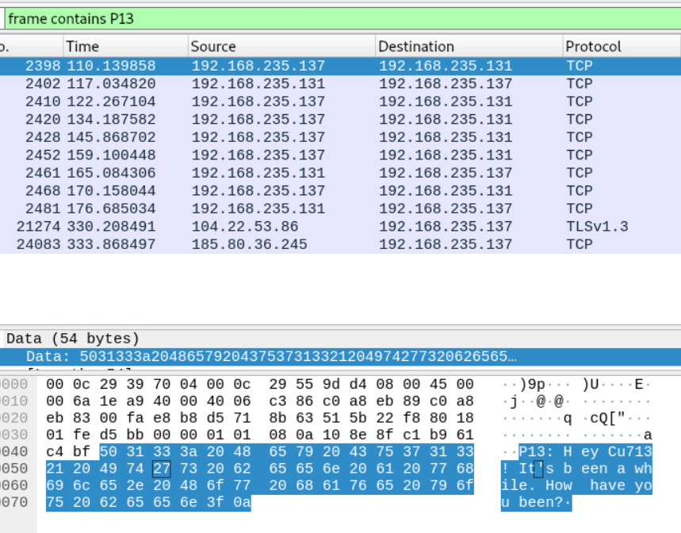
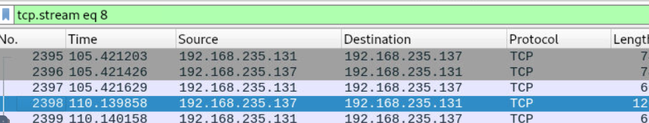
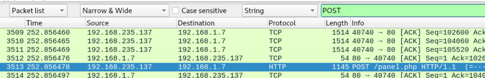
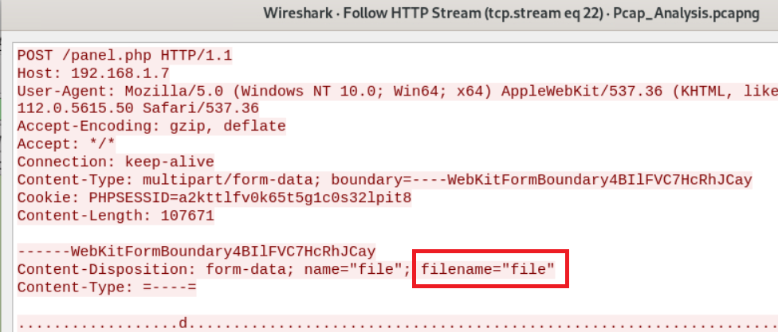
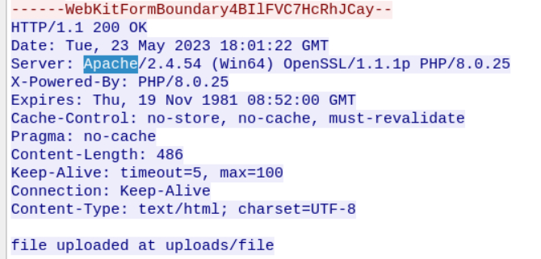
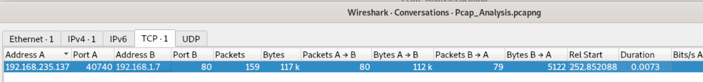

> # PCAP Analysis

## Summary

### Q1. In network communication, what are the IP addresses of the sender and receiver? 
Base on the hint `"Find the chat. Sender: P13"`, search the frame contains P13 string to find the packet. 
 
The follow TCP Stream to find which IP send the first packet. 
 
At packet 2398, the sender is 192.168.235.137 
**Answer:** 192.168.235.137,192.168.235.131

### Q2. P13 uploaded a file to the web server. What is the IP address of the server?
When we upload a file to server, the `POST` method was used, search for the `POST` string, you will see the answer. 
 
**Answer:** 192.168.1.7

### Q3. What is the name of the file that was sent through the network?
Follow HTTP stream at the above packet you will see the filename in the header. 
 
**Answer:** file

### Q4. What is the name of the web server where the file was uploaded?
From the header's respone of server, you will see the field `Server` contain the web server's. 
 
**Answer:** Apache

### Q5. What directory was the file uploaded to?
From the above image, the file was uploaded to `uploads`. 
**Answer:** uploads

### Q6. How long did it take the sender to send the encrypted file?
Go to `Statistics -> Conversations`, then select `TCP` tab then tick `Limit to display filter` to see the connection between the sender and the web server. 
 
**Answer:** 0.0073