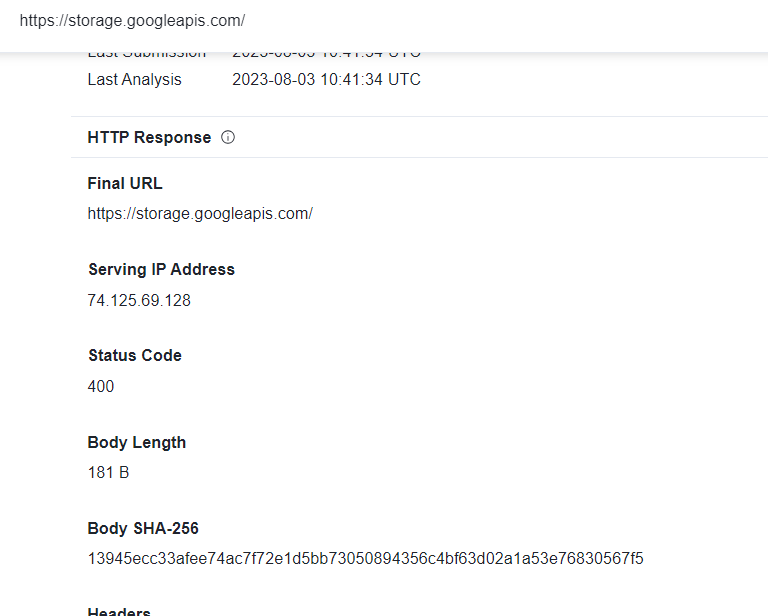

> # Phishing Email

## Summary
<!-- TOC -->

- [Summary](#summary)
    - [Q1. What is the return path of the email?](#q1-what-is-the-return-path-of-the-email)
    - [Q2. What is the domain name of the url in this mail?](#q2-what-is-the-domain-name-of-the-url-in-this-mail)
    - [Q3. Is the domain mentioned in the previous question suspicious?](#q3-is-the-domain-mentioned-in-the-previous-question-suspicious)
    - [Q4. What is the body SHA-256 of the domain?](#q4-what-is-the-body-sha-256-of-the-domain)
    - [Q5. Is this email a phishing email?](#q5-is-this-email-a-phishing-email)

<!-- /TOC -->

### Q1. What is the return path of the email?
We need to install python's module to analyze the .eml file.<br>
`pip install eml-analyzer`
`Return-Path` is in `Header` of the email.<br>
```
$ emlAnalyzer -i paypal.eml --header | grep -i return-path
Return-Path....................<bounce@rjttznyzjjzydnillquh.designclub.uk.com>
```
**Answer:** bounce@rjttznyzjjzydnillquh.designclub.uk.com

### Q2. What is the domain name of the url in this mail?
Run 1emlAnalyzer without --header.
```
$ emlAnalyzer -i paypal.eml         
 =================
 ||  Structure  ||
 =================
|- multipart/report                      
|  |- multipart/related                  
|  |  |- multipart/alternative           
|  |  |  |- text/plain                   
|  |  |  |- text/html                    

 ==================================
 ||  URLs in HTML and text part  ||
 ==================================
 - https://storage.googleapis.com/hqyoqzatqthj/aemmfcylvxeo.html#QORHNZC44FT4.QORHNZC44FT4?dYCTywfcxr3jcxxrmcdcKBdmc5D6qfcJVcbbb4M
 - https://storage.googleapis.com/hqyoqzatqthj/aemmfcylvxeo.html#QORHNZC44FT4.QORHNZC44FT4?dYCTywccxr3jcxxrmcdcKBdmc5D6qfcJVcbbb4M
 - https://storage.googleapis.com/hqyoqzatqthj/aemmfcylvxeo.html#QORHNZC44FT4.QORHNZC44FT4?dYCTywdcxr3jcxxrmcdcKBdmc5D6qfcJVcbbb4M

 ===============================================
 ||  Reloaded Content (aka. Tracking Pixels)  ||
 ===============================================
[+] No content found which will be reloaded from external resources

 ===================
 ||  Attachments  ||
 ===================
[+] E-Mail contains no attachments
```
**Answer:** storage.googleapis.com

### Q3. Is the domain mentioned in the previous question suspicious?
It's use a random name behind the URL.<br>
**Answer:** yes

### Q4. What is the body SHA-256 of the domain?
Pasthe domain to [VirusTotal](https://www.virustotal.com/gui/url/054986e91a2e2ae036ea77fad7516026381625b97b4e92c88274c5d211d693d8/details), you will see the body SHA-256 of the domain.<br>
<br>
**Answer:** 13945ecc33afee74ac7f72e1d5bb73050894356c4bf63d02a1a53e76830567f5

### Q5. Is this email a phishing email?
**Answer:** yes
