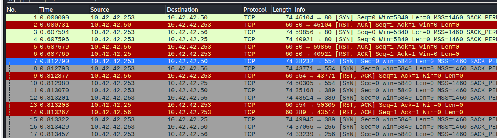
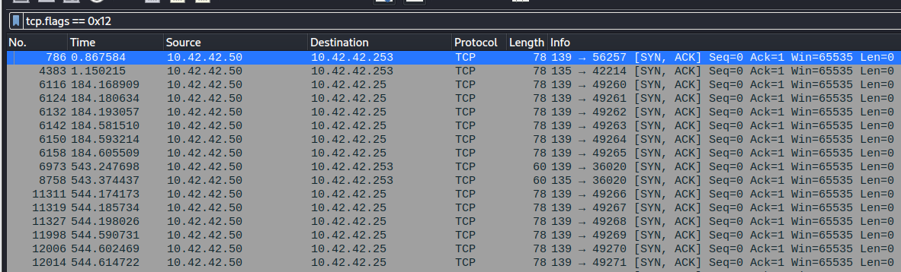
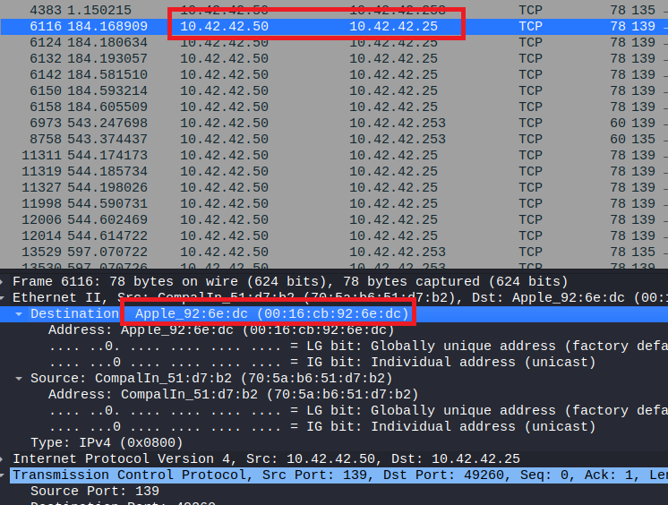

> # Port Scan Activity

# Summary
<!-- TOC -->

- [Summary](#summary)
    - [Q1. What is the IP address scanning the environment?](#q1-what-is-the-ip-address-scanning-the-environment)
    - [Q2. What is the IP address found as a result of the scan?](#q2-what-is-the-ip-address-found-as-a-result-of-the-scan)
    - [Q3. What is the MAC address of the Apple system it finds?](#q3-what-is-the-mac-address-of-the-apple-system-it-finds)
    - [Q4. What is the IP address of the detected Windows system?](#q4-what-is-the-ip-address-of-the-detected-windows-system)

<!-- /TOC -->

## Q1. What is the IP address scanning the environment?
Open the pcap file, the IP `10.42.42.253` send multiple packet to hosts in the same subnet. 
 
**Answer:** 10.42.42.253

## Q2. What is the IP address found as a result of the scan?
If the IP is live, it will send SYN/ACK packet back to the scanning host, filter on WireShark with `tcp.flags == 0x12` (0x2 is SYN and 0x10 is ACK). 
 
**Answer:** 10.42.42.50

## Q3. What is the MAC address of the Apple system it finds?
From IP `10.42.42.50`, it found the Apple system with IP `10.42.42.25`, you will see the MAC address in `Ethenet II`. 
 
**Answer:** 00:16:cb:92:6e:dc

## Q4. What is the IP address of the detected Windows system?
**Answer:** 10.42.42.50