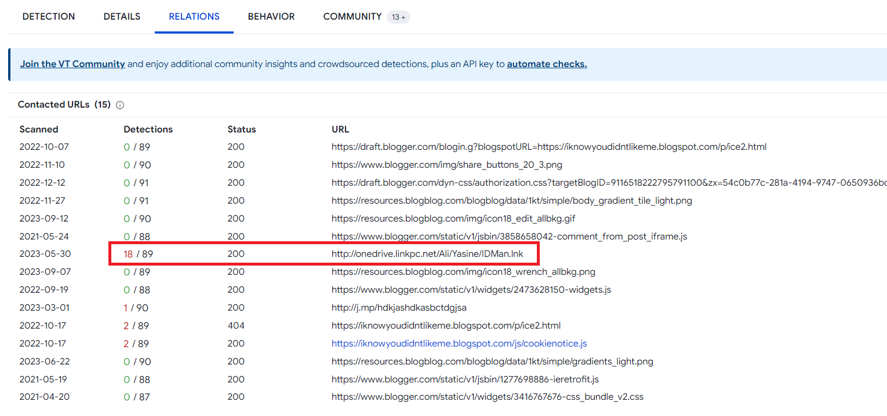

> # Presentation As a Malware

# Summary
<!-- TOC -->

- [Summary](#summary)
    - [Q1. What was the general name / category of the malicious file in the analyzed ppt file?](#q1-what-was-the-general-name--category-of-the-malicious-file-in-the-analyzed-ppt-file)
    - [Q2. Which of the url addresses it communicates with has been detected as harmful by sandboxes?](#q2-which-of-the-url-addresses-it-communicates-with-has-been-detected-as-harmful-by-sandboxes)
    - [Q3. What is the name of the htm file that drops to disk?](#q3-what-is-the-name-of-the-htm-file-that-drops-to-disk)
    - [Q4. Which process is running to persistent under mshta.exe after the relevant malware runs?](#q4-which-process-is-running-to-persistent-under-mshtaexe-after-the-relevant-malware-runs)
    - [Q5. If there was a snort IDS in the environment at the time of the incident, which rules would it match?](#q5-if-there-was-a-snort-ids-in-the-environment-at-the-time-of-the-incident-which-rules-would-it-match)

<!-- /TOC -->

## Q1. What was the general name / category of the malicious file in the analyzed ppt file?
Calculate sha256 then submit to [VirusTotal](https://www.virustotal.com/gui/file/0289ee3c551ba84d34ab1760d042ab420733d96dbfedfae9718f8eb138c3259b)
```
$ sha256sum PO\#00187.ppt 
0289ee3c551ba84d34ab1760d042ab420733d96dbfedfae9718f8eb138c3259b  PO#00187.ppt
```
<br>
**Answer:** VB:Trojan

## Q2. Which of the url addresses it communicates with has been detected as harmful by sandboxes?
In `Relations` tab, there is a URL flagged with 18/89.<br>
<br>
**Answer:** http://onedrive.linkpc.net/Ali/Yasine/IDMan.lnk

## Q3. What is the name of the htm file that drops to disk?
In `Files Dropped` of `Dr.Web vxCube` sandbox, there is a file with .htm extension.<br>
<br>
**Answer:** hdkjashdkasbctdgjsa[1].htm

## Q4. Which process is running to persistent under mshta.exe after the relevant malware runs?
`Schtasks.exe` is use to create a scheduled task to run program in a interval time.<br>
<br>
**Answer:** schtasks.exe

## Q5. If there was a snort IDS in the environment at the time of the incident, which rules would it match?
In `Dr.Web vxCube` sandbox, 3 rules is matched.<br>
<br>
**Answer:** EVENT_CTE_HEADER
