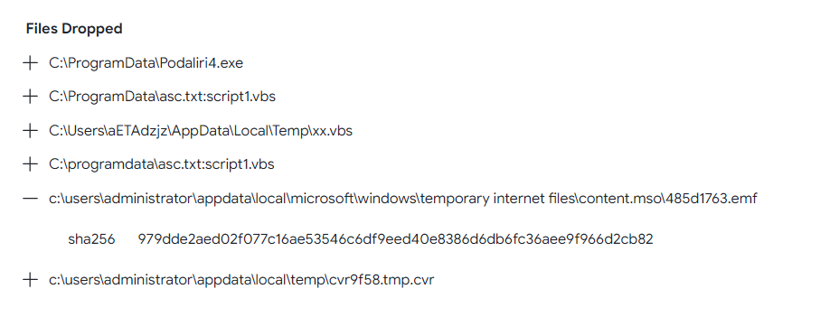
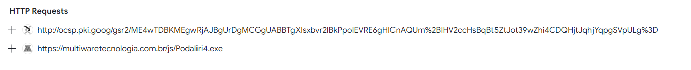

> # Remote Working

# Summary
<!-- TOC -->

- [Summary](#summary)
    - [Q1. What is the date the file was created?](#q1-what-is-the-date-the-file-was-created)
    - [Q2. With what name is the file detected by Bitdefender antivirus?](#q2-with-what-name-is-the-file-detected-by-bitdefender-antivirus)
    - [Q3. How many files are dropped on the disk?](#q3-how-many-files-are-dropped-on-the-disk)
    - [Q4. What is the sha-256 hash of the file with emf extension it drops?](#q4-what-is-the-sha-256-hash-of-the-file-with-emf-extension-it-drops)
    - [Q5. What is the exact url to which the relevant file goes to download spyware?](#q5-what-is-the-exact-url-to-which-the-relevant-file-goes-to-download-spyware)

<!-- /TOC -->

## Q1. What is the date the file was created?
Use `exiftool`.<br>
```
$ exiftool ORDER\ SHEET\ \&\ SPEC.xlsm 
ExifTool Version Number         : 12.63
File Name                       : ORDER SHEET & SPEC.xlsm
Directory                       : .
File Size                       : 2.8 MB
File Modification Date/Time     : 2021:01:29 09:28:08-05:00
File Access Date/Time           : 2023:09:16 02:00:52-04:00
File Inode Change Date/Time     : 2023:09:16 02:00:47-04:00
File Permissions                : -rw-r--r--
File Type                       : XLSM
File Type Extension             : xlsm
MIME Type                       : application/vnd.ms-excel.sheet.macroEnabled.12
Zip Required Version            : 20
Zip Bit Flag                    : 0
Zip Compression                 : Deflated
Zip Modify Date                 : 2021:01:28 11:55:34
Zip CRC                         : 0xcdc0e5bf
Zip Compressed Size             : 427
Zip Uncompressed Size           : 1789
Zip File Name                   : [Content_Types].xml
Application                     : Microsoft Excel
Doc Security                    : None
Scale Crop                      : No
Heading Pairs                   : Worksheets, 3
Titles Of Parts                 : Sheet1, Sheet2, Sheet3
Links Up To Date                : No
Shared Doc                      : No
Hyperlinks Changed              : No
App Version                     : 12.0000
Creator                         : Windows
Last Modified By                : Windows
Create Date                     : 2020:02:01 18:28:07Z
Modify Date                     : 2020:02:01 18:32:27Z                                                      
```
**Answer:** 2020-02-01 18:28:07

## Q2. With what name is the file detected by Bitdefender antivirus?
Calculate sha256, then submit to [VirusTotal](https://www.virustotal.com/gui/file/7bcd31bd41686c32663c7cabf42b18c50399e3b3b4533fc2ff002d9f2e058813)
```
$ sha256sum ORDER\ SHEET\ \&\ SPEC.xlsm 
7bcd31bd41686c32663c7cabf42b18c50399e3b3b4533fc2ff002d9f2e058813  ORDER SHEET & SPEC.xlsm
```
Search `BitDefender`, you will see the anwser.<br>
**Answer:** Trojan.GenericKD.36266294

## Q3. How many files are dropped on the disk?
On VMRay sandbox, the are three dropped files on the disk.<br>
<br>
**Answer:** 3

## Q4. What is the sha-256 hash of the file with emf extension it drops?
<br>
**Answer:** 979dde2aed02f077c16ae53546c6df9eed40e8386d6db6fc36aee9f966d2cb82

## Q5. What is the exact url to which the relevant file goes to download spyware?
In HTTP request panel,
<br>

